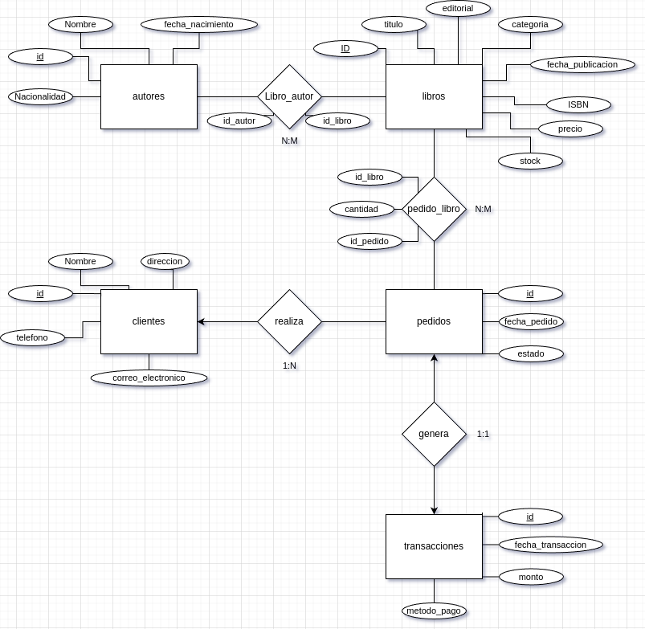
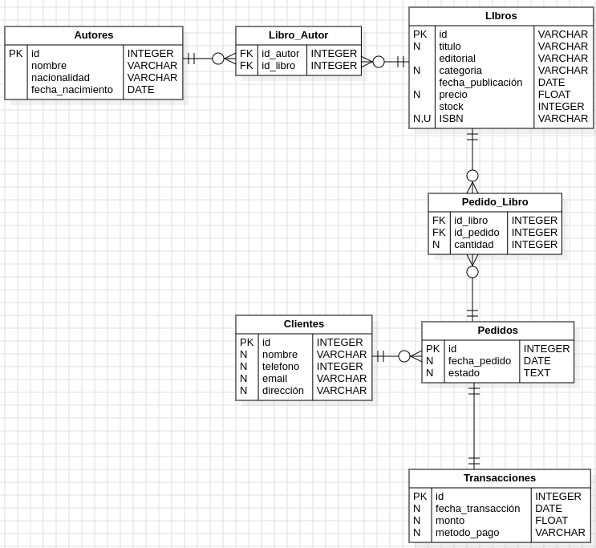

# TiendiBros - Diagrama UML E-R

## Entidades y Atributos

### 1. **Libros**

* **Descripción**: Representa los libros disponibles en la tienda.
* **Atributos**:
  * `ID_Libro` (PK): Identificador único para cada libro.
  * `Título`: El título del libro.
  * `ISBN` (Unique): Número único internacional para identificar el libro.
  * `Editorial`: La editorial que publica el libro.
  * `Categoría`: El género o categoría del libro.
  * `Fecha_Publicación`: La fecha en la que el libro fue publicado.
  * `Precio`: Precio de venta del libro.
  * `Cantidad_Stock`: La cantidad de libros disponibles en inventario.

### 2. **Autores**

* **Descripción**: Almacena la información de los autores.
* **Atributos**:
  * `ID_Autor` (PK): Identificador único del autor.
  * `Nombre`: Nombre completo del autor.
  * `Fecha_Nacimiento`: Fecha de nacimiento del autor.
  * `Nacionalidad`: Nacionalidad del autor.

### 3. **Clientes**

* **Descripción**: Contiene los datos de los clientes que se registran en la  tienda.
* **Atributos**:
  * `ID_Cliente` (PK): Identificador único del cliente.
  * `Nombre`: Nombre completo del cliente.
  * `Correo_Electrónico`: Dirección de correo electrónico del cliente.
  * `Teléfono`: Número de teléfono de contacto.
  * `Dirección`: Dirección física del cliente.

### 4. **Pedidos**

* **Descripción**: Registra las compras realizadas por los clientes.
* **Atributos**:
  * `ID_Pedido` (PK): Identificador único del pedido.
  * `Fecha_Pedido`: Fecha en la que se realizó el pedido.
  * `Estado`: Estado actual del pedido (pendiente, procesado, completado).

### 5. **Transacciones**

* **Descripción**: Almacena información sobre el pago de los pedidos.
* **Atributos**:
  * `ID_Transacción` (PK): Identificador único de la transacción.
  * `Método_Pago`: Método de pago utilizado (tarjeta de crédito, PayPal, etc.).
  * `Monto_Total`: Monto total de la transacción.
  * `Fecha_Transacción`: Fecha en la que se realizó la transacción.

## Relaciones y Restricciones

1. **Libros - Autores (Muchos a Muchos)**:
   * **Un libro puede ser escrito por uno o más autores** Y A SU VEZ **un autor puede haber escrito varios libros.**
   * **Se utiliza una tabla intermedia (**`Libro_Autor`) que contiene los atributos `ID_Libro` y `ID_Autor` como claves foráneas para establecer la relación.
2. **Clientes - Pedidos (Uno a Muchos)**:
   * **Un cliente puede realizar varios pedidos** Y A SU VEZ **cada pedido está asociado a un solo cliente.**
3. **Pedidos - Libros (Muchos a Muchos)**:
   * **Un pedido puede incluir múltiples libros** Y A SU VEZ **un libro puede estar en varios pedidos.**
   * **Se utiliza una tabla intermedia (**`Pedido_Libro`) que contiene los atributos `ID_Pedido`, `ID_Libro` y `Cantidad` para registrar la cantidad de cada libro en el pedido.
4. **Pedidos - Transacciones (Uno a Uno)**:
   * **Cada pedido genera una única transacción de compra** Y A SU VEZ **una transacción está asociada a un solo pedido.**
5. **Restricciones**:
   * `ISBN` en la tabla **Libros** debe ser único para evitar registros duplicados.
   * **La cantidad en stock (**`Cantidad_Stock`) en la tabla **Libros** se debe actualizar cada vez que se realice una compra.
   * **Las claves primarias (**`ID_Libro`, `ID_Autor`, `ID_Cliente`, `ID_Pedido`, `ID_Transacción`) son auto-generadas para garantizar que cada registro tenga un identificador único.
   * **Las claves foráneas se utilizan para mantener la integridad referencial entre tablas.**

## Decisiones de Diseño

* Se optó por una relación muchos a muchos entre ****Libros** y **Autores** para reflejar la naturaleza de los libros con múltiples autores y autores que escriben múltiples libros.
* Se añadió una entidad intermedia (****Pedido_Libro**) para registrar la cantidad de libros en cada pedido y así modelar correctamente la relación muchos a muchos.
* La entidad ****Transacciones** se mantiene separada de **Pedidos** para almacenar detalles específicos de pago, garantizando una mejor separación de preocupaciones.

## Modelo E-R resultante

## Modelo UML E-R resultante

